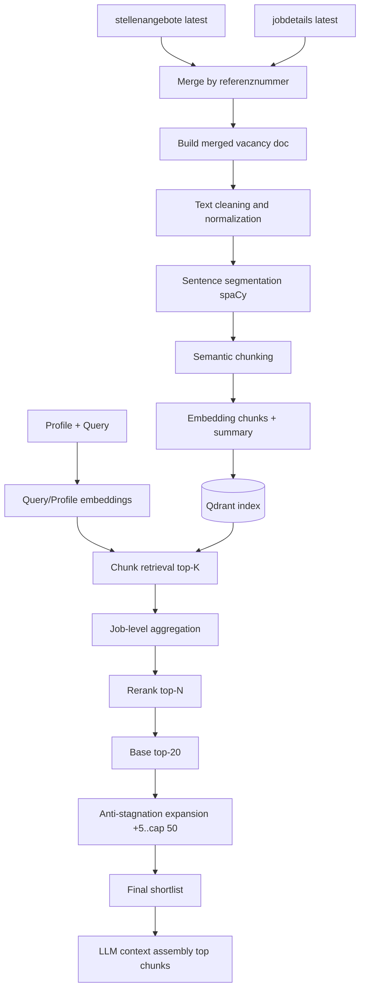

# Retrieval Pipeline

## Purpose

Shows the full path from Mongo vacancy data to final shortlist used by LLM handoff.

```mermaid
flowchart TD
    A[stellenangebote latest] --> C[Merge by referenznummer]
    B[jobdetails latest] --> C

    C --> D[Build merged vacancy doc]
    D --> E[Text cleaning and normalization]
    E --> F[Sentence segmentation spaCy]
    F --> G[Semantic chunking]
    G --> H[Embedding chunks + summary]

    H --> I[(Qdrant index)]
    J[Profile + Query] --> K[Query/Profile embeddings]
    K --> L[Chunk retrieval top-K]
    I --> L

    L --> M[Job-level aggregation]
    M --> N[Rerank top-N]
    N --> O[Base top-20]
    O --> P[Anti-stagnation expansion +5..cap 50]
    P --> Q[Final shortlist]
    Q --> R[LLM context assembly top chunks]
```
