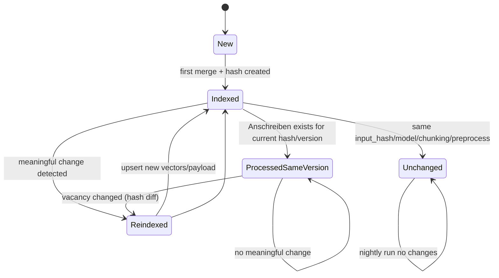

# Vacancy Version State

## Purpose

Defines when vacancy embeddings should be recomputed and when processing can be skipped.

```mermaid
stateDiagram-v2
    [*] --> New
    New --> Indexed: first merge + hash created
    Indexed --> Unchanged: same input_hash/model/chunking/preprocess
    Unchanged --> Unchanged: nightly run no changes
    Indexed --> Reindexed: meaningful change detected
    Reindexed --> Indexed: upsert new vectors/payload

    Indexed --> ProcessedSameVersion: Anschreiben exists for current hash/version
    ProcessedSameVersion --> ProcessedSameVersion: no meaningful change
    ProcessedSameVersion --> Reindexed: vacancy changed (hash diff)
    Reindexed --> Indexed
```
