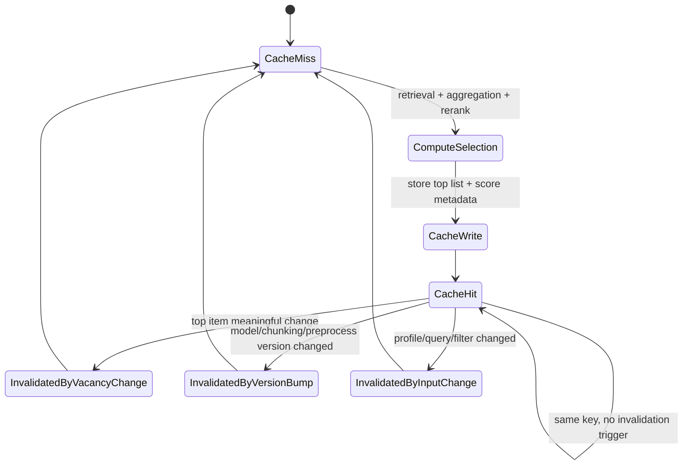

# Selection Cache State

## Purpose

Shows cache lifecycle for `(profile + query + filters + versions)` selection results.

```mermaid
stateDiagram-v2
    [*] --> CacheMiss
    CacheMiss --> ComputeSelection: retrieval + aggregation + rerank
    ComputeSelection --> CacheWrite: store top list + score metadata
    CacheWrite --> CacheHit

    CacheHit --> CacheHit: same key, no invalidation trigger
    CacheHit --> InvalidatedByVacancyChange: top item meaningful change
    CacheHit --> InvalidatedByVersionBump: model/chunking/preprocess version changed
    CacheHit --> InvalidatedByInputChange: profile/query/filter changed

    InvalidatedByVacancyChange --> CacheMiss
    InvalidatedByVersionBump --> CacheMiss
    InvalidatedByInputChange --> CacheMiss
```
