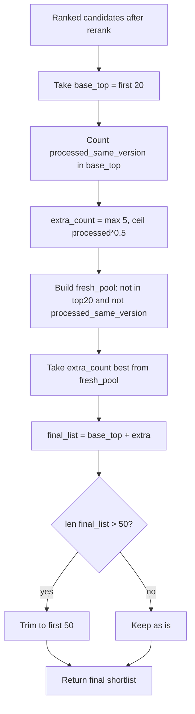

# Top-20 Expansion Logic

## Purpose

Documents anti-stagnation logic: keep top quality while forcing new candidates into results.

```mermaid
flowchart TD
    A[Ranked candidates after rerank] --> B[Take base_top = first 20]
    B --> C[Count processed_same_version in base_top]
    C --> D[extra_count = max 5, ceil processed*0.5]
    D --> E[Build fresh_pool: not in top20 and not processed_same_version]
    E --> F[Take extra_count best from fresh_pool]
    F --> G[final_list = base_top + extra]
    G --> H{len final_list > 50?}
    H -- yes --> I[Trim to first 50]
    H -- no --> J[Keep as is]
    I --> K[Return final shortlist]
    J --> K
```
