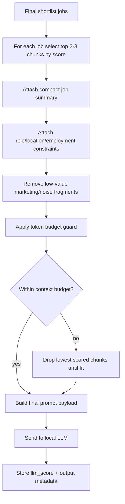

# LLM Context Assembly

## Purpose

Describes how compact context is built from shortlisted vacancies to avoid token bloat.

```mermaid
flowchart TD
    A[Final shortlist jobs] --> B[For each job select top 2-3 chunks by score]
    B --> C[Attach compact job summary]
    C --> D[Attach role/location/employment constraints]
    D --> E[Remove low-value marketing/noise fragments]
    E --> F[Apply token budget guard]
    F --> G{Within context budget?}
    G -- no --> H[Drop lowest scored chunks until fit]
    G -- yes --> I[Build final prompt payload]
    H --> I
    I --> J[Send to local LLM]
    J --> K[Store llm_score + output metadata]
```
