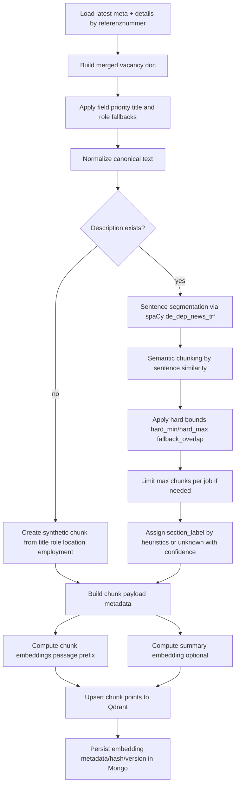

# Embedding/Chunking Flow Diagram

## Purpose

Shows how merged vacancy data is transformed into semantic chunks and vectors.

```mermaid
flowchart TD
    A[Load latest meta + details by referenznummer] --> B[Build merged vacancy doc]
    B --> C[Apply field priority title and role fallbacks]
    C --> D[Normalize canonical text]
    D --> E{Description exists?}

    E -- no --> F[Create synthetic chunk from title role location employment]
    E -- yes --> G[Sentence segmentation via spaCy de_dep_news_trf]
    G --> H[Semantic chunking by sentence similarity]
    H --> I[Apply hard bounds hard_min/hard_max fallback_overlap]
    I --> J[Limit max chunks per job if needed]
    J --> S[Assign section_label by heuristics or unknown with confidence]

    F --> K[Build chunk payload metadata]
    S --> K

    K --> L[Compute chunk embeddings passage prefix]
    K --> M[Compute summary embedding optional]
    L --> N[Upsert chunk points to Qdrant]
    M --> N
    N --> O[Persist embedding metadata/hash/version in Mongo]
```
