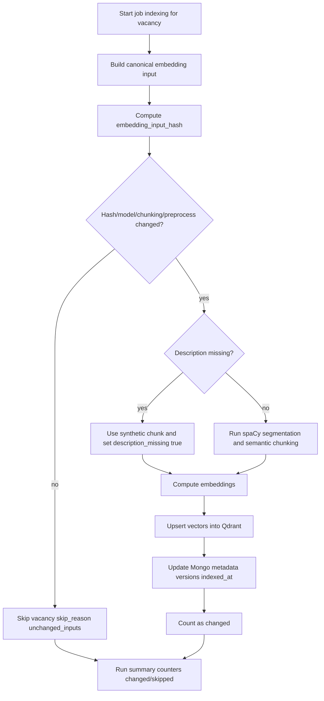

# Embedding Reindex Decision Diagram

## Purpose

Shows strict decision rules for `skip` vs `reindex`, including missing-description fallback.

```mermaid
flowchart TD
    A[Start job indexing for vacancy] --> B[Build canonical embedding input]
    B --> C[Compute embedding_input_hash]
    C --> D{Hash/model/chunking/preprocess changed?}

    D -- no --> E[Skip vacancy skip_reason unchanged_inputs]
    D -- yes --> F{Description missing?}

    F -- yes --> G[Use synthetic chunk and set description_missing true]
    F -- no --> H[Run spaCy segmentation and semantic chunking]

    G --> I[Compute embeddings]
    H --> I
    I --> J[Upsert vectors into Qdrant]
    J --> K[Update Mongo metadata versions indexed_at]
    K --> L[Count as changed]

    E --> M[Run summary counters changed/skipped]
    L --> M
```

