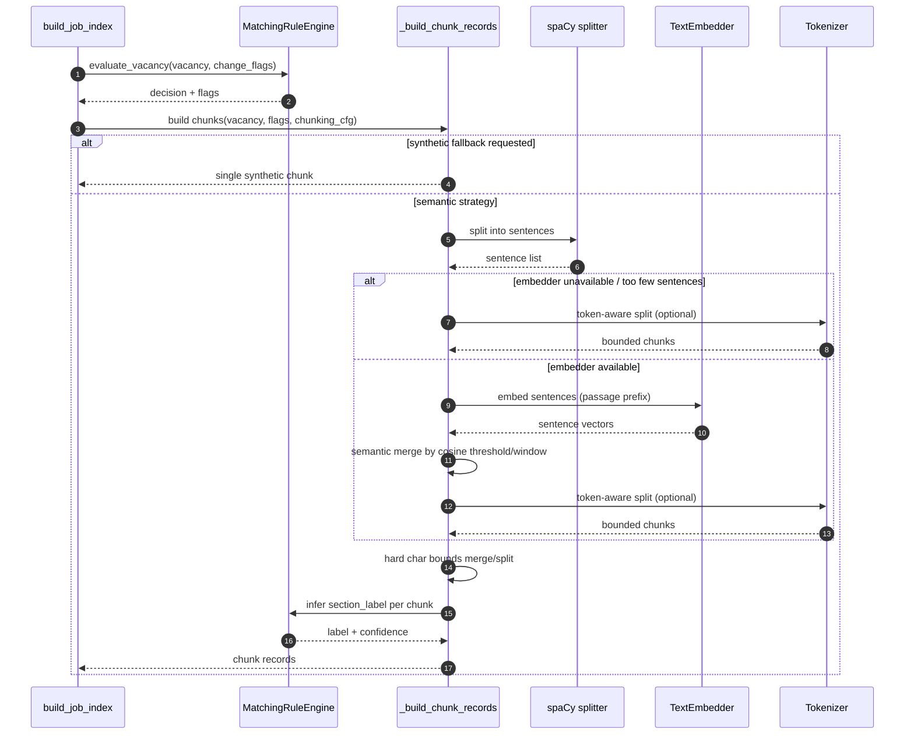

# Phase 2 Chunking Runtime Flow

## Purpose

This diagram shows the exact runtime sequence inside `app.build_job_index` when chunk records are built.

```mermaid
sequenceDiagram
    autonumber
    participant IDX as build_job_index
    participant RULE as MatchingRuleEngine
    participant CH as _build_chunk_records
    participant SP as spaCy splitter
    participant EMB as TextEmbedder
    participant TOK as Tokenizer

    IDX->>RULE: evaluate_vacancy(vacancy, change_flags)
    RULE-->>IDX: decision + flags
    IDX->>CH: build chunks(vacancy, flags, chunking_cfg)

    alt synthetic fallback requested
        CH-->>IDX: single synthetic chunk
    else semantic strategy
        CH->>SP: split into sentences
        SP-->>CH: sentence list
        alt embedder unavailable / too few sentences
            CH->>TOK: token-aware split (optional)
            TOK-->>CH: bounded chunks
        else embedder available
            CH->>EMB: embed sentences (passage prefix)
            EMB-->>CH: sentence vectors
            CH->>CH: semantic merge by cosine threshold/window
            CH->>TOK: token-aware split (optional)
            TOK-->>CH: bounded chunks
        end
        CH->>CH: hard char bounds merge/split
        CH->>RULE: infer section_label per chunk
        RULE-->>CH: label + confidence
        CH-->>IDX: chunk records
    end
```
