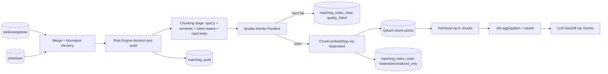

# Phase 2 Chunking System Integration

## Purpose

This diagram explains how the chunking stage interacts with storage, quality checks, and downstream retrieval.

```mermaid
flowchart LR
    A[(stellenangebote)] --> C[Merge + Normalize Vacancy]
    B[(jobdetails)] --> C
    C --> D[Rule Engine decision and audit]
    D --> E[Chunking stage: spaCy + semantic + token-aware + hard limits]
    E --> F[Quality checks Pandera]
    F -->|hard fail| G[(matching_index_state: quality_failed)]
    F -->|pass| H[Chunk embeddings via fastembed]
    H --> I[(Qdrant chunk points)]
    H --> J[(matching_index_state: indexed/normalized_only)]
    D --> K[(matching_audit)]
    I --> L[Retrieval top-K chunks]
    L --> M[Job aggregation + rerank]
    M --> N[LLM handoff top chunks]
```
