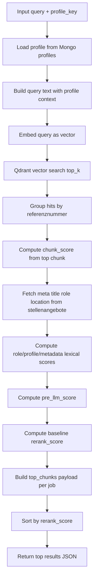

# Retrieval + Rerank Runtime Flow

## Purpose

Shows the current implemented runtime flow in `app/search_jobs.py`.

```mermaid
flowchart TD
    A[Input query + profile_key] --> B[Load profile from Mongo profiles]
    B --> C[Build query text with profile context]
    C --> D[Embed query as vector]
    D --> E[Qdrant vector search top_k]
    E --> F[Group hits by referenznummer]
    F --> G[Compute chunk_score from top chunk]
    G --> H[Fetch meta title role location from stellenangebote]
    H --> I[Compute role/profile/metadata lexical scores]
    I --> J[Compute pre_llm_score]
    J --> K[Compute baseline rerank_score]
    K --> L[Build top_chunks payload per job]
    L --> M[Sort by rerank_score]
    M --> N[Return top results JSON]
```
